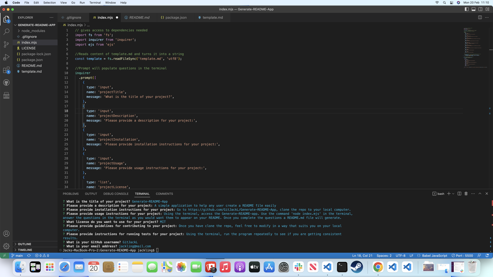

# Generate-README-App

## Description

A simple application to help any user create a README file easily

## Table of Contents

- [Installation](#installation)
- [Usage](#usage)
- [License](#license)
- [Contributing](#contributing)
- [Tests](#tests)
- [Questions](#questions)

## Installation

Go to https://github.com/GitJackL/Generate-README-App, clone the repo to your local computer.

## Usage

Using the terminal, access the Generate-README-app. Use the command &#39;node index.mjs&#39; in the terminal, answer the questions in the terminal as you would want them to appear on your README. Once you complete the questions a README.md file will generate.  

## License

## Contributing

Once you have clone the repo, feel free to modify in a way that suits you on your local computer.

## Tests

Using the terminal, run the program repeatedly to see if you are getting consistent results.

## Questions

If you have any questions about the repo, open an issue or contact GitJackL directly at jackling@mail.com.

## Screen shot

